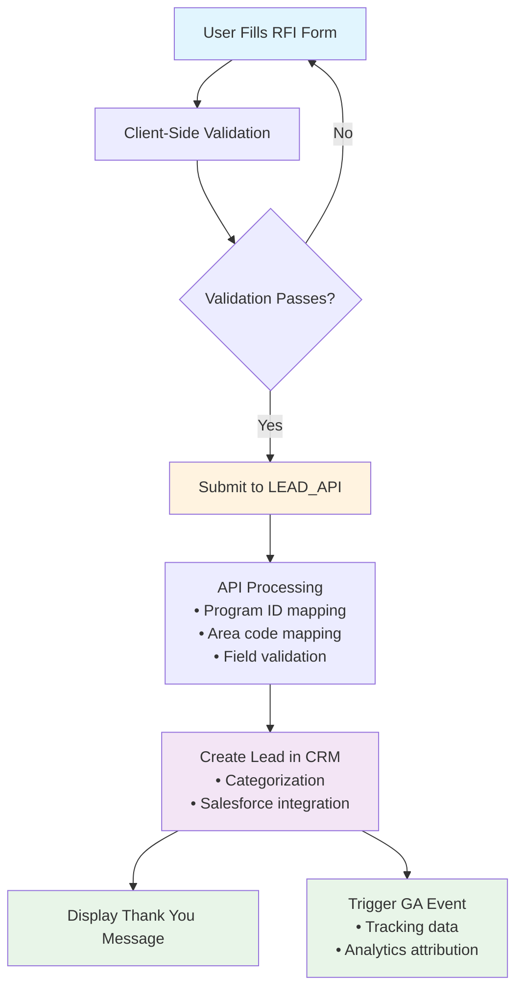

# "Request Information" Form (Quick-Guide)

This guide provides an overview of how the "Request Information" (RFI) forms operate and how data passes to the LEAD_API.

## Why It Matters

The RFI form is the **biggest source of inquiries** for UAGC, directly contributing to:
- Lead generation
- Enrollments
- Revenue

## Key Owners

- **Anthony**: Front-end implementation
- **Omar**: Tracking and SEO

## Change Request Checklist

To modify a Request Information form:

1. Log an Asana "RF Change" task
2. Describe the specific tweak needed:
   - Label changes
   - Field additions/removals
   - Validation rules
   - Tracking modifications

## Implementation Process

The standard workflow for RFI form changes:

1. Anthony creates a prototype of the form changes
2. Brian performs QA on the implementation
3. Omar verifies the data layer is capturing correct information
4. Brandy schedules the publish date
5. Post-launch: Verify leads and GA events in dashboard

---

## RFI Form Optimization Project

### Step 1: Naming Convention

**Objective:** Ensure that the naming convention `[Primary Category]_[Subcategory]_[Form Name]_[Form ID]` is fully defined and agreed upon by all stakeholders.

#### Site Categories & Subcategories

| Primary Category | URL | Subcategories |
|-----------------|-----|---------------|
| **Online Degrees** | `/online-degrees` | Bachelors, Masters, Doctoral, Associates |
| **Admissions** | `/admissions` | New Students, Returning Students, Military Students, Academic Catalog, Office of the Registrar |
| **Tuition & Financial Aid** | `/tuition-financial-aid` | Scholarships, Grants, Military, Corporate Partnerships, Academic Partnerships |
| **Student Experience** | `/student-experience` | Student Resources, Graduation, Dean's List, Student Success Stories |
| **Partnerships** | `/partnerships` | Corporate, Academic |
| **Military** | `/military` | Active-duty, Military Spouses, Tuition, Veterans, Military Alliance |
| **Blog** | `/blog` | - |
| **Paid** | `/success` | College, Degree-types, Online-degree, Programs |

#### Form Types & IDs

| Form Name | Type | Form ID |
|-----------|------|---------|
| `Sticky_rfi_form` | 2 step form | `001` |
| `Mid_page_rfi_form` | 2 step form | `002` |
| `Modal_pop_up_form` | 1 step form | `003` |
| `Paid_rfi_form` | 2 step form | `004` |
| `Blog_rfi_form` | 2 step form | `005` |

#### Naming Convention Examples

**Sticky-RFI-Top Form (Bachelor's Degree in Business):**
- **Output:** `online-degrees_Bachelors_sticky_rfi_001`

**Mid-Page-RFI Form (Master's Degree in Psychology):**
- **Output:** `OnlineDegrees_Masters_mid_page_rfi_002`

**Modal Popup Form (Doctoral Degree in Education):**
- **Output:** `OnlineDegrees_Doctoral_Modal-rfi_003`

**Paid Form (Associate's Degree in Healthcare):**
- **Output:** `success_degree-programs-v7_PaidLeadForm_004`

**Blog Form (Student Experience Article):**
- **Output:** `StudentExperience_Articles_BlogLeadForm_005`

---

### Step 2: Update Form Naming in Drupal

**Objective:** Ensure that all forms are named according to the new convention within Drupal CMS.

**Action Items:**
1. **Rename Forms:** Update the name of each form to follow the `[Primary Category]_[Subcategory]_[Form Name]_[Form ID]` format
2. **Verify Changes:** Double-check that each form's name has been updated correctly and consistently across the site

---

### Step 3: Lead Flow System (LFS) Values

**Objective:** Streamline the LFS by removing or deprecating legacy fields and ensuring that only relevant, actively used data is captured and processed.

#### Contact Information
| Field | Example Value |
|-------|---------------|
| First Name | John |
| Last Name | Wick |
| Phone | 2125550123 |
| Email | john.wick@continental.com |

#### Interest Information
| Field | Example Value |
|-------|---------------|
| State | New York |
| Degree Level | Bachelor's |
| Area of Interest | Criminal Justice |
| Select Your Degree | BA in Criminal Justice |
| Are you currently a licensed RN? | No |
| Are you a member of the military? | Yes |
| Unique Lead ID | uagc-website-1723154296748 |
| Vendor | uagc-homegrown |
| LFS Status | 1 |
| TCPA Checkbox | Yes, I agree to the contact methods outlined below |

#### Marketing Information (Optimized)
| Field | Example Value |
|-------|---------------|
| Primary_category | Success |
| Subcategory | degree-types |
| Form Name | PaidLeadForm |
| Form ID | 004 |
| Form Destination | /request-information/thank-you |
| Submission ID (SID) | 6439516 |
| UAGC Analytics ID | GA4-userid |
| clientid | 2847D21A-696E-4880-B229-2256306A83F5 |
| originpage | (full URL with UTM parameters) |
| last_page | /page |
| refererurl | www.ashford.edu |
| revisionid | ASH.112916 |
| sourceid | 19AULIDCP |
| Utm_source | linkedin |
| Utm_medium | paid_social |
| Utm_campaign | (campaign name) |
| Utm_content | li_prospecting_SC_UG_2023 |
| device_type | mobile |
| userEngagementDuration | 3m 23s |
| Experiment ID1 | 30151390290 |
| Experience Variation | ExpA_30145600789 |
| leadid_tcpa_disclosure | true |

**Rationale:** Legacy fields like `Subsource1`, `Subsource2`, `WebInitiatingUrl`, `callcenterURL`, and `Something Else Choice` have been removed to streamline the system.

---

### Step 4: GA4 Event Tracking

**Objective:** Ensure that each parameter is correctly capturing and passing the intended data.

#### Event: `request_information_submit`
**Form Variables:**
- `form_name`: `{{DLV - Form Name}}`
- `form_id`: `{{DLV - Form ID}}`
- `form_type`: `{{DLV - Form type}}`
- `form_state`: `{{DLV - Form State}}`
- `form_degree_of_interest`: `{{DLV - Form Degree of Interest}}`
- `form_degree`: `{{DLV - Form Degree}}`
- `form_destination`: `{{DLV - Form Destination}}`

**Cookies:**
- `source`: `{{Cookie - utm_source}}`
- `affiliate_id`: `{{Cookie - affiliateid}}`
- `medium`: `{{Cookie - utm_medium}}`
- `campaign`: `{{Cookie - utm_campaign}}`
- `visitor_uuid`: `{{Cookie - visitorUUID - Clientid}}`
- `Page_count`: `{{Cookie - Page Count}}`

**Other:**
- `exp_variant_string`: `{{DLV - Optimizely exp_variant_string}}`
- `Custom_event_name`: `{{Event}}`
- `User_data`: `{{UPD - user provided data}}`

#### Event: `request_information_step_1`
Same form variables and cookies as above, without `Page_count` and `User_data`.

#### Event: `request_information_start`
**Form Variables:**
- `form_name`, `form_id`, `form_type`, `form_destination`

**Other:**
- `page_location`: `{{Page URL}}`

#### Event: `request_information_abandon`
**Other:**
- `Error reason`: `{{DLV - Error Reason}}`

#### Event: `rfi_error`
Full form variables plus `Error Reason`: `{{DLV - Error Reason}}`

#### Testing and Validation
1. **Use DebugView:** Use GA4 DebugView to test the event after making adjustments
2. **Test Across Scenarios:** Test on different forms (Sticky-RFI-Top, Paid Form) to ensure consistency
3. **Monitor Initial Data:** After deployment, monitor the first few days of data

#### Reporting Setup
1. **Custom Reports:** Create reports utilizing `Form_name`, `Form_id`, and other key parameters
2. **Funnel Visualization:** Track user journey from form start to submission
3. **Conversion Tracking:** Set up `Request_information_submit` as a conversion in GA4

---

### Step 5: Implement Custom Dimensions

**Objective:** Use custom dimensions to enhance reporting and segmentation in GA4.

**Action Items:**
1. **Set Up Custom Dimensions:** Map to respective event parameters (primary category, subcategory, form name, form ID)
2. **Validate Custom Dimensions:** Ensure GA4 is correctly capturing these dimensions

---

### Step 6: Monitor and Analyze Initial Data

**Objective:** Ensure that the new naming convention is correctly implemented.

**Action Items:**
1. **Monitor Data:** Continuously monitor form submission data in GA4 for the first week
2. **Check for Discrepancies:** Look for anomalies or errors (missing/incorrect values)
3. **Adjust as Needed:** If issues are found, adjust event tracking or naming convention

---

### Step 7: Optimize Forms Based on Insights

**Objective:** Use GA4 data to optimize forms for better performance.

**Action Items:**
1. **Analyze User Behavior:** Use GA4 to analyze interactions, drop-off rates, conversion rates
2. **Conduct A/A Testing:** Validate that tracking setup is airtight
3. **Transition to A/B Testing:** Identify which form structure and field order drive best results
4. **Implement Changes:** Based on A/B testing results

---

### Step 8: Document the Process

**Objective:** Ensure all steps, decisions, and changes are documented.

**Action Items:**
1. **Create Documentation:** Document naming convention, GA4 setup, form optimization strategies
2. **Share with Team:** Distribute to all relevant team members

---

### Step 9: Regular Review and Maintenance

**Objective:** Maintain accuracy and effectiveness over time.

**Action Items:**
1. **Update Naming Convention:** As new forms are added or modified
2. **Continuous Optimization:** Based on user feedback and data insights

---

## Form Structure & Field Specifications

### User-Facing Fields

#### Contact Information Section
| Field Key | Type | Label | Required | Validation/Notes |
|-----------|------|-------|----------|------------------|
| `firstname` | textfield | First Name | ✓ | Max 50 chars, pattern: `^[a-zA-Z]*$` |
| `lastname` | textfield | Last Name | ✓ | Max 50 chars, pattern: `^[a-zA-Z]*$` |
| `phone1` | tel | Phone | ✓ | Max 30 chars, placeholder: "123 123 1234" |
| `emailaddress` | email | Email | ✓ | Max 100 chars, email regex pattern |

#### Interest Information Section
| Field Key | Type | Label | Required | Options/Notes |
|-----------|------|-------|----------|---------------|
| `state` | select | State | ✓ | Sourced from `taxonomy_term_state` |
| `degree_level` | select | Degree Level | — | Initially hidden, from `taxonomy_term_degree_level` |
| `college_of_interest` | select | Area of Interest | ✓ | See [Area of Interest Values](#area-of-interest-values) |
| `clientdegreeid` | select | Select Your Degree | ✓ | See [Degree Program Values](#degree-program-values) |
| `registerednurse` | radios | Are you currently a licensed RN? | — | Yes/No options |
| `are_you_a_member_of_the_military_` | radios | Are you a member of the military? | — | Yes/No (default: No) |

#### Agreement & Submission
| Field Key | Type | Label | Required | Notes |
|-----------|------|-------|----------|-------|
| `tcpa_checkbox` | checkbox | "I agree to the contact methods..." | ✓ | TCPA compliance |
| `actions` | webform_actions | Submit button | — | Label: "Request Information" |

## Field Value Mappings

### Area of Interest Values
When a user selects an area of interest, these values are sent to the Lead API:

| Display Name | API Value (`college_of_interest`) |
|--------------|-----------------------------------|
| Business | 0 |
| Criminal Justice | 1 |
| Education | 2 |
| Health Care | 3 |
| Information Technology | 4 |
| Liberal Arts | 5 |
| Social & Behavioral Science | 6 |

### Degree Program Values
Each degree program has a specific ID (`clientdegreeid`) sent to the Lead API:

#### Business Programs
| Program Name | ID |
|--------------|-----|
| AA in Business | 1294 |
| AA in Organizational Management | 1297 |
| BA in Accounting | 1298 |
| BA in Business Administration | 1302 |
| BA in Business Leadership | 1305 |
| BA in Finance | 1321 |
| BA in Human Resources Management | 1332 |
| BA in Marketing | 1850 |
| BA in Operations Management and Analysis | 1340 |
| BA in Organizational Management | 1341 |
| BA in Project Management | 1343 |
| MA in Organizational Management | 1371 |
| MS in Finance | 1853 |
| Master of Accountancy | 1688 |
| Master of Business Administration MBA | 1373 |
| Master of Human Resource Management | 1841 |
| * Undecided (Business) | 1830 |

#### Criminal Justice Programs
| Program Name | ID |
|--------------|-----|
| BA in Homeland Security and Emergency Management | 1331 |
| BA in Social and Criminal Justice | 1349 |
| Master of Science in Criminal Justice | 1694 |
| * Undecided (Criminal Justice) | 1832 |

#### Education Programs
| Program Name | ID |
|--------------|-----|
| AA in Early Childhood Education | 1295 |
| BA in Child Development | 1306 |
| BA in Early Childhood Development with Differentiated Instruction | 1849 |
| BA in Early Childhood Education | 1312 |
| BA in Early Childhood Education Administration | 1313 |
| BA in Education Studies | 1315 |
| BA in Instructional Design | 1333 |
| MA in Early Childhood Education Leadership | 1846 |
| MA in Education | 1355 |
| MA in Special Education | 1817 |
| MS in Instructional Design & Technology | 1845 |
| Post Baccalaureate Teaching Certificate | 1921 |
| * Undecided (Education) | 1833 |

#### Health Care Programs
| Program Name | ID |
|--------------|-----|
| BA in Health Care Administration | 1325 |
| BS in Health Information Management | 1681 |
| BS in Nursing (RN to BSN) | 1818 |
| MA in Health Care Administration | 1370 |
| MS in Health Informatics & Analytics | 1854 |
| Master of Public Health (MPH) | 1847 |
| * Undecided (Health Care) | 1834 |

#### Information Technology Programs
| Program Name | ID |
|--------------|-----|
| BA in Business Information Systems | 1304 |
| BS in Computer Software Technology | 1856 |
| BS in Cyber & Data Security Technology | 1857 |
| BS in Information Technology | 1848 |
| MS in Technology Management | 1893 |
| Master of Information Systems Management (MISM) | 1840 |
| * Undecided (Information Technology) | 1835 |

#### Liberal Arts Programs
| Program Name | ID |
|--------------|-----|
| AA in Military Studies | 1296 |
| BA in Liberal Arts | 1337 |
| * Undecided (Liberal Arts) | 1836 |

#### Social & Behavioral Science Programs
| Program Name | ID |
|--------------|-----|
| BA in Applied Behavioral Science | 1300 |
| BA in Health and Human Services | 1323 |
| BA in Psychology | 1344 |
| BA in Sociology | 1351 |
| MA in Human Services | 1890 |
| MA in Psychology | 1689 |
| * Undecided (Social & Behavioral Science) | 1838 |

## Hidden Fields & System Tracking

The RFI form includes numerous hidden fields for tracking and system functionality:

### Lead Tracking Fields
| Field Name | Purpose |
|------------|---------|
| `unique_lead_id` | Lead-tracking UUID |
| `vendor` | Source tag (default: uagc-homegrown) |

### URL Tracking
| Field Name | Purpose |
|------------|---------|
| `weblandingurl` | Landing page URL |
| `callcenterurl` | Call center URL |

### Form & System Identifiers
| Field Name | Purpose |
|------------|---------|
| `clientdocumentid` | Form ID from Drupal |
| `sourceid` | Marketing source code (default: ADE219) |
| `rfi_form_name`, `rfi_form_type`, `rfi_form_id` | Internal form identifiers |

### Analytics & Testing
| Field Name | Purpose |
|------------|---------|
| `referrer`, `originpage`, `clientid` | Analytics/attribution data |
| `device_type` | Device type tracking |
| `uagc_analytics_google_id` | Google Analytics client ID |
| `experiment_id1`...`4`, `experience_variation1`...`4` | Multi-experiment tracking slots |

### Compliance & Legal
| Field Name | Purpose |
|------------|---------|
| `lid_lead_id` | LeadID token for TrustedForm/Jornaya |
| `leadid_tcpa_disclosure` | TCPA disclosure shown flag (default: true) |

### Partnership & Portal
| Field Name | Purpose |
|------------|---------|
| `partner_id`, `partner_name` | Internal partnership tags |
| `programid` | Salesforce Program ID |

## Data Flow

1. User submits form
2. Form data is validated client-side
3. Data is sent to LEAD_API with all field mappings
4. API processes the information using the program IDs and area codes
5. Lead is created in CRM with proper categorization
6. Thank you message is displayed to user
7. GA event is triggered with tracking data

## Technical Notes

- **Validation**: Client-side validation uses specific patterns (e.g., names must be alphabetic only)
- **Dynamic Fields**: Some fields like `degree_level` start hidden and are revealed by JavaScript
- **Undecided Options**: Programs marked with "*" are "Undecided" categories for each area of interest
- **State Restrictions**: Dynamic validation messages show program/state restrictions as needed
- **TCPA Compliance**: Required checkbox with full disclosure paragraph

## Deep-Dive Documentation

For detailed technical specifications and API documentation, refer to the RFI Technical Documentation in the "Dev Reference" folder.

---

**Data Sources**: Field mappings and specifications pulled from RFI form analysis and Lead API integration documentation.
